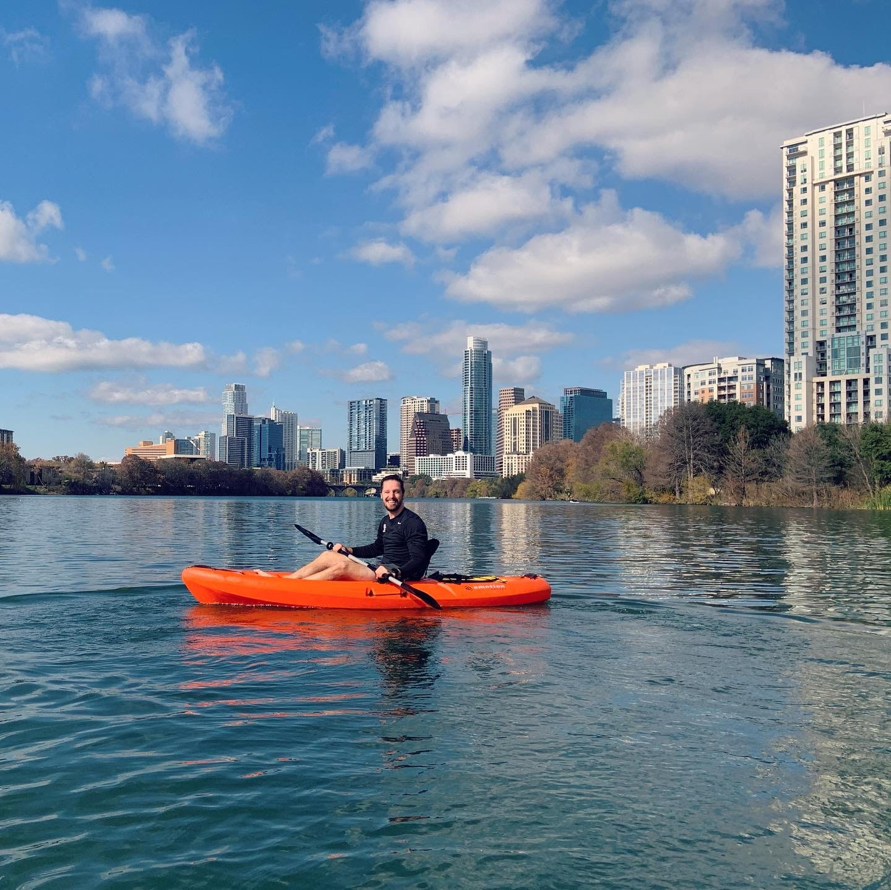
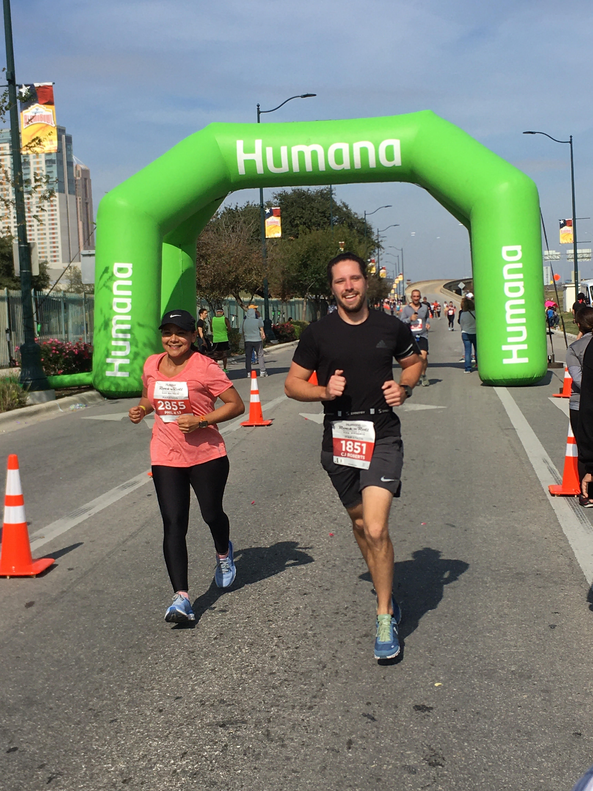

## Hi there

Welcome to my site! My name is Charles Roberts and I am aspiring to be a front-end developer. I live in Austin, Tx and spend most of my free time coding, running or kayaking. This website and blog will serve as a way for me to communicate my progress towards becoming a hired developer along with being a record of my progression. Currently, my focus is on the frontend framework/library React.js. There is so much out there to learn and I am excited to keep improving my knowledge and myself. My main goal for this year, outside of landing my first developer job, is to be somebody today, that I would be proud of tomorrow. Thank you so much for checking out my site and if you'd like to learn more about me, feel free to check out my [INSTAGRAM](https://instagram.com/cj_roberts) and my [TWITTER](https://twitter.com/cjrobertstech) where I post daily about my coding progress.

> Kayaking in beautiful downtown Austin

> Approaching the finish line of the 2019 Rock 'n' Roll, San Antonio Marathon

**— Charles Roberts**
