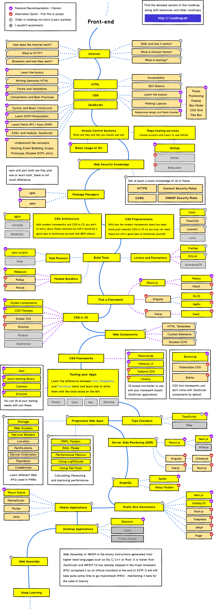

## Front-end Developer Roadmap

This is probably the greatest resource I have found when it comes to front-end development. Starting out can be overwhelming. There are so many technologies and many of them build off of each other. This roadmap greatly simplifies things and shows you a straight forward path. By following this roadmap, you can avoid the pitfall of not knowing what to learn first and jumping around to often. It shows to the most important skills to learn along with many resourse to learn those skills. I highly recommend checking out the full article for more in depth discussion on the topic. you can find it by clicking [HERE](https://levelup.gitconnected.com/the-2020-web-developer-roadmap-76503ddfb327)

